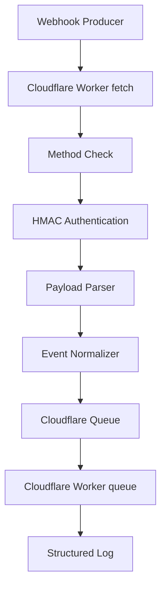

# 系统架构

## 当前实现

当前实现包含 Cloudflare Workers 的最小可运行骨架：

- `src/index.ts` 暴露默认 Worker handler。
- `fetch` handler 处理 webhook HTTP 请求。
- `queue` handler 处理 Cloudflare Queue 消息。
- `src/types.ts` 定义 Worker 环境绑定、通知事件、投递记录和错误响应类型。
- `src/request.ts` 提供 request identifier 生成和 webhook method 校验。
- `src/responses.ts` 提供统一 JSON 响应、错误响应、405 响应和配置缺失响应。
- `src/auth.ts` 提供 HMAC-SHA256 webhook 认证、raw body 签名输入构造和 5 分钟时间窗口校验。
- `src/parser.ts` 提供 raw body JSON 解析和 payload 字段验证。
- `src/normalizer.ts` 提供 `NotificationEvent` 标准化。
- `src/queue.ts` 提供 Cloudflare Queue producer 适配器和入队失败结构化日志。
- `src/delivery.ts` 提供 Queue consumer 下游 HTTP 投递、响应分类、重试判断和投递日志。
- `src/logger.ts` 提供请求生命周期日志、投递尝试日志、Queue 失败日志和敏感字段脱敏。
- `wrangler.toml` 声明 Worker 入口、默认变量、Queue producer 和 Queue consumer。

## 请求链路

## 现有行为

- `POST` 请求会先读取 raw body，并使用 `X-Webhook-Timestamp`、`X-Webhook-Signature` 和 `X-Webhook-Id` 执行 HMAC-SHA256 认证。
- 签名输入格式为 `timestamp + "." + rawBody`。
- timestamp 超过 5 分钟接受窗口时返回 `WEBHOOK_SIGNATURE_EXPIRED`。
- 签名错误或签名头缺失时返回 `WEBHOOK_INVALID_SIGNATURE`。
- `WEBHOOK_SECRET` 缺失时返回 `WEBHOOK_CONFIG_MISSING`。
- raw body 必须是 JSON object，JSON 解析失败时返回 `WEBHOOK_INVALID_JSON`。
- `type` 字段可选，存在时必须是字符串；缺失时使用 `DEFAULT_EVENT_TYPE`。
- `metadata` 字段可选，存在时必须是 JSON object。
- payload 验证失败时返回 `WEBHOOK_INVALID_PAYLOAD` 和字段错误。
- 认证成功且 payload 有效时会创建标准化 `NotificationEvent` 并发送到 `WEBHOOK_EVENTS` Queue。
- Queue binding 缺失时返回 `WEBHOOK_CONFIG_MISSING`。
- Queue send 失败时返回 `WEBHOOK_QUEUE_UNAVAILABLE`，并写入结构化错误日志。
- 非 `POST` 请求返回 `405`，响应头包含 `Allow: POST`。
- 成功入队后返回 `202`，响应体包含 `eventId` 和 `requestId`。
- 所有 HTTP 响应包含 `X-Request-Id`。
- 错误响应使用统一结构，错误码来自 `WebhookErrorCode`。
- Queue consumer 会读取 `NotificationEvent` 并以 HTTP POST JSON body 投递到 `TARGET_URL`。
- 下游 HTTP 2xx 响应会记录成功投递并 ack 消息。
- 下游 HTTP 408、429、5xx 响应会记录临时失败，并在 5 次最大尝试内调用 Queue retry。
- 下游其他响应会记录终态失败并 ack 消息。
- 请求生命周期会记录 request identifier、producer identity、event type、processing outcome 和稳定错误码。
- 投递尝试会记录 request identifier、target identifier、attempt number、status、HTTP status 和 latency。
- 日志会脱敏 key 名包含 authorization、secret、signature、token、password、key 的字段。

## 后续架构目标

后续任务会补齐结构化日志集中封装和敏感信息脱敏。

## 端到端入口链路

当前 `fetch` handler 已串联完整 webhook 入口链路：method check、HMAC 认证、JSON 解析、payload 验证、事件标准化、Cloudflare Queue 入队和请求生命周期日志。
