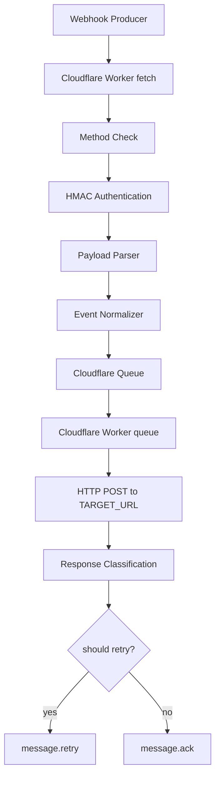

# 系统架构

## 系统概述

Webhook Worker Channel 是 Cloudflare Workers 上的异步 webhook 通知渠道。系统由两部分组成：

- **同步入口**（`fetch` handler）：完成认证、解析、标准化和入队，立即返回 `202`。
- **异步投递**（`queue` handler）：消费 Cloudflare Queue 消息，以 HTTP POST 投递到下游，按响应分类决定 ack 或 retry。

入口与投递通过 Cloudflare Queue 解耦，生产者无需感知下游状态，下游故障通过 Queue 重试机制吸收。

## 技术栈

- 运行时：Cloudflare Workers
- 语言：TypeScript（`compatibility_date = "2026-07-02"`）
- 异步通道：Cloudflare Queues（`webhook-events`）
- 构建/部署：Wrangler 4.x
- 类型：`@cloudflare/workers-types` 4.x

## 项目结构

```text
src/
  index.ts        Worker fetch + queue 入口
  auth.ts         HMAC-SHA256 认证
  parser.ts       raw body 解析与 payload 验证
  normalizer.ts   NotificationEvent 标准化
  queue.ts        Queue producer 适配
  delivery.ts     下游 HTTP 投递与分类
  logger.ts       结构化日志与脱敏
  request.ts      request id 与方法校验
  responses.ts    统一 JSON 响应
  types.ts        核心类型与错误码
package.json
tsconfig.json
wrangler.toml
```

## 核心模块

| 模块 | 职责 |
|------|------|
| `index.ts` | 编排入口链路和投递链路 |
| `auth.ts` | HMAC-SHA256 认证、时间窗口、常数时间比较 |
| `parser.ts` | JSON 解析、object 校验、字段验证 |
| `normalizer.ts` | payload → NotificationEvent |
| `queue.ts` | Queue producer 入队与失败日志 |
| `delivery.ts` | 下游 HTTP POST、响应分类、重试判断 |
| `logger.ts` | 结构化日志、敏感字段脱敏 |
| `responses.ts` | 统一 JSON 响应与错误响应 |
| `request.ts` | request id 生成与方法校验 |
| `types.ts` | Env、NotificationEvent、错误码等契约 |

## 请求链路



## 投递链路

Queue consumer 对每条消息执行：

1. `attemptNumber = message.attempts + 1`。
2. `deliverNotificationEvent` 以 POST JSON 投递到 `TARGET_URL`。
3. `logDeliveryAttempt` 输出结构化日志。
4. `shouldRetryDelivery` 判断：
   - `transient_failure` 且未达 5 次 → `message.retry()`。
   - 其他或已达上限 → `message.ack()`。

## 运行行为

- `POST` 请求先读取 raw body，使用 `X-Webhook-Timestamp`、`X-Webhook-Signature`、`X-Webhook-Id` 执行 HMAC-SHA256 认证。
- 签名输入为 `timestamp + "." + rawBody`。
- timestamp 超过 5 分钟接受窗口返回 `WEBHOOK_SIGNATURE_EXPIRED`。
- 签名错误或签名头缺失返回 `WEBHOOK_INVALID_SIGNATURE`。
- `WEBHOOK_SECRET` 缺失返回 `WEBHOOK_CONFIG_MISSING`。
- raw body 必须是 JSON object，解析失败返回 `WEBHOOK_INVALID_JSON`。
- `type` 可选，存在时必须是 string；缺失时使用 `DEFAULT_EVENT_TYPE`。
- `metadata` 可选，存在时必须是 JSON object。
- payload 验证失败返回 `WEBHOOK_INVALID_PAYLOAD` 和字段错误。
- 认证成功且 payload 有效时创建 `NotificationEvent` 并入队。
- Queue binding 缺失返回 `WEBHOOK_CONFIG_MISSING`。
- Queue send 失败返回 `WEBHOOK_QUEUE_UNAVAILABLE` 并写 `queue_failure` 日志。
- 非 `POST` 请求返回 `405`，响应头含 `Allow: POST`。
- 成功入队返回 `202`，响应体含 `eventId` 和 `requestId`。
- 所有 HTTP 响应包含 `X-Request-Id`。
- 错误响应使用 `ErrorResponseBody` 统一结构。
- Queue consumer 以 HTTP POST JSON 投递 `NotificationEvent` 到 `TARGET_URL`。
- 下游 2xx → `success` → ack。
- 下游 408/429/5xx → `transient_failure` → 5 次内 retry。
- 下游其他状态 → `terminal_failure` → ack。
- 请求生命周期日志记录 requestId、producerId、eventType、outcome、code。
- 投递尝试日志记录 requestId、eventId、targetId、attempt、status、httpStatus、latencyMs、completedAt。
- 日志脱敏字段名匹配 `authorization|secret|signature|token|password|key`。

## 设计决策

- **入口与投递解耦**：生产者请求只做同步预处理，投递交给 Queue consumer，避免延长生产者请求生命周期。
- **首版无持久化**：结构化日志作为投递记录来源，降低实现复杂度，后续可引入 D1/KV。
- **HMAC-SHA256**：适合 webhook 场景，可验证请求体完整性并降低伪造风险。
- **通用 HTTP endpoint**：首版下游为通用 HTTP endpoint，后续可扩展飞书/企微/钉钉等专用适配器。
- **常数时间比较**：签名比对使用 `timingSafeEqual`，降低时序侧信道风险。

## 后续架构目标

- 引入 D1/KV 持久化投递记录，支持查询和补偿。
- 扩展专用下游适配器（飞书、企微、钉钉）。
- 引入 Vitest/Workers 测试环境，补齐单元测试与集成测试。
- 启用 `WEBHOOK_UNAUTHORIZED` 和 `WEBHOOK_DELIVERY_FAILED` 错误码的运行路径。

## 端到端入口链路

`fetch` handler 已串联完整 webhook 入口链路：method check、HMAC 认证、JSON 解析、payload 验证、事件标准化、Cloudflare Queue 入队和请求生命周期日志。详见 [Cloudflare Workers 入口链路](./专有概念/cloudflare-workers-entry-pipeline.md)。
