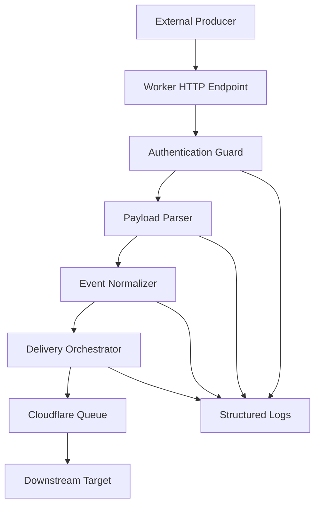

# Webhook Worker Channel

Feature Name: webhook-worker-channel
Updated: 2026-07-02

## Description

The Webhook Worker Channel is a serverless notification ingress that runs on Cloudflare Workers. It exposes an HTTP endpoint, authenticates webhook producers with HMAC-SHA256 signatures, normalizes request payloads into Notification Events, and dispatches events to configured HTTP endpoints with logging and retry support.

The repository currently has no application source files, so this design defines the initial architecture and module boundaries for a new implementation.

## Architecture



The Worker receives requests through the Cloudflare Workers Fetch handler. The handler performs lightweight validation synchronously and then pushes accepted events into a Cloudflare Queue. A queue consumer performs downstream delivery and retries without extending the producer-facing request lifecycle.

## Components and Interfaces

### Worker Entrypoint

- Owns the `fetch(request, env, ctx)` style request lifecycle.
- Routes POST webhook requests to the channel handler.
- Returns structured JSON responses with stable error codes.
- Adds the request identifier to response headers.
- Publishes accepted Notification Events to a Cloudflare Queue binding.

### Authentication Guard

- Validates HMAC-SHA256 signatures with `X-Webhook-Timestamp`, `X-Webhook-Signature`, and `X-Webhook-Id` request headers.
- Builds the signed payload from `timestamp + "." + rawBody`.
- Rejects requests outside a five-minute timestamp acceptance window.
- Reads secrets from Worker bindings or environment variables.
- Produces an authenticated producer identity for downstream processing.

### Payload Parser

- Parses JSON request bodies.
- Enforces content type, payload size, and body parse constraints where supported by the runtime.
- Produces field-level validation errors for malformed or incomplete payloads.

### Event Normalizer

- Maps raw payload fields into the Notification Event model.
- Applies default event type configuration.
- Preserves raw payload data for audit and debugging.

### Delivery Orchestrator

- Consumes Notification Events from a Cloudflare Queue.
- Sends outbound requests with Worker-compatible `fetch` APIs.
- Classifies delivery responses as successful, transient failure, or terminal failure.
- Applies retry policy for transient failures with a maximum of five attempts.
- Sends Notification Events to downstream targets through HTTP POST JSON requests.

### Cloudflare Configuration

- Uses `wrangler.toml` to declare the Worker entrypoint, environment variables, secrets, and queue bindings.
- Stores authentication secrets through Cloudflare Worker secrets.
- Uses Cloudflare Queues for asynchronous delivery.
- Uses structured logs as the first implementation's delivery record source.
- Can add Cloudflare D1 later for persistent delivery records if audit retention or replay becomes a requirement.

### Observability Adapter

- Emits structured logs for request lifecycle and delivery attempts.
- Uses stable error codes shared by HTTP responses and logs.
- Redacts secrets and authentication material before logging.

## Data Models

### Notification Event

```json
{
  "id": "evt_01h...",
  "requestId": "req_01h...",
  "producerId": "producer-name",
  "source": "webhook",
  "type": "event.created",
  "payload": {},
  "metadata": {},
  "receivedAt": "2026-07-02T00:00:00.000Z"
}
```

### Delivery Attempt

```json
{
  "eventId": "evt_01h...",
  "targetId": "target-name",
  "attempt": 1,
  "status": "success",
  "httpStatus": 200,
  "latencyMs": 42,
  "completedAt": "2026-07-02T00:00:00.000Z"
}
```

### Error Response

```json
{
  "error": {
    "code": "WEBHOOK_INVALID_PAYLOAD",
    "message": "The webhook payload failed validation.",
    "fields": [
      {
        "path": "type",
        "code": "required"
      }
    ]
  },
  "requestId": "req_01h..."
}
```

## Correctness Properties

- Every accepted webhook request creates exactly one Notification Event identifier.
- Every HTTP response includes the request identifier used in logs.
- Authentication is completed before payload normalization and delivery.
- Delivery attempts never log secret values, tokens, signatures, or complete authorization headers.
- Retry classification uses explicit status groups and target-specific rules from configuration.
- Accepted webhook requests are acknowledged after successful enqueue to Cloudflare Queue.
- HMAC signatures are calculated over the raw request body before JSON parsing.

## Error Handling

- `WEBHOOK_METHOD_NOT_ALLOWED`: request method is unsupported, returns HTTP 405.
- `WEBHOOK_UNAUTHORIZED`: authentication validation fails, returns HTTP 401.
- `WEBHOOK_SIGNATURE_EXPIRED`: webhook timestamp is outside the acceptance window, returns HTTP 401.
- `WEBHOOK_INVALID_SIGNATURE`: HMAC validation fails, returns HTTP 401.
- `WEBHOOK_INVALID_JSON`: request body parsing fails, returns HTTP 400.
- `WEBHOOK_INVALID_PAYLOAD`: payload validation fails, returns HTTP 422.
- `WEBHOOK_CONFIG_MISSING`: required Cloudflare binding or channel configuration is missing, returns HTTP 500.
- `WEBHOOK_QUEUE_UNAVAILABLE`: enqueue operation fails, returns HTTP 503.
- `WEBHOOK_DELIVERY_FAILED`: delivery reaches a terminal failure state, recorded in logs and delivery records.

## Test Strategy

- Unit test request method handling, HMAC signature validation, JSON parsing, payload validation, and event normalization.
- Unit test retry classification for successful, transient, and terminal downstream responses.
- Integration test Worker fetch handler with representative valid and invalid webhook requests.
- Integration test Cloudflare Queue publishing against a test queue binding.
- Queue consumer tests should verify that accepted events are delivered with the same request identifier and event identifier.
- Observability tests should assert stable error codes and redaction of secret-bearing fields.

## Implementation Plan

1. Create a Cloudflare Workers TypeScript project with `wrangler.toml`, queue binding, TypeScript config, and test setup.
2. Implement HMAC-SHA256 authentication using Cloudflare Web Crypto APIs.
3. Implement raw body capture, JSON parsing, payload validation, and Notification Event normalization.
4. Implement Cloudflare Queue publishing from the webhook entrypoint.
5. Implement queue consumer delivery to generic HTTP endpoints.
6. Implement retry classification, stable error responses, and structured logs.
7. Add unit and integration tests for auth, parsing, normalization, enqueue, and delivery behavior.

## References

- No project source references are available yet because the repository currently contains no application files.
